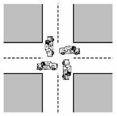
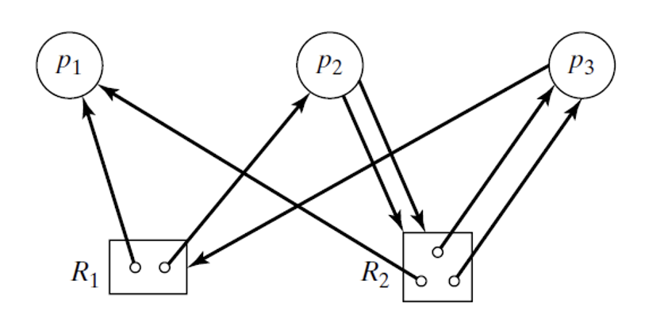
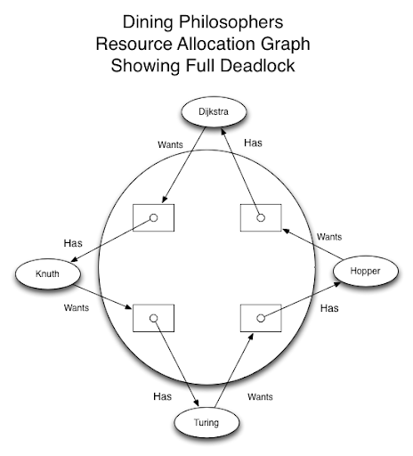

# Week 5

## Deadlock

When two or more processes are waiting for each other to finish and they are forever stuck because of their co-dependency.

### Conditions
You can only have a deadlock if **ALL** of the below are true

* Mutual exclusion
  * i.e. Things can't run in parallel
* Hold and wait
  * i.e. they're both keeping something and awaiting for something else to happen
* No preemption
  * i.e. There is no other decision mechanism or a 3rd party to manage this
  * Once it receives the resources, it will not give it back until it's done
* Circular waiting
  * They have to wait for one another

If one of these is false, then the situation **cannot** produce a deadlock.

### Prevention strategies

* Detection & recovery
  * Let processes execute uninhibited
  * e.g. terminate deadlocked processes
* Prevention
  * Change the static rules so you can't have a deadlock
* Avoidance
  * Use dynamic rules so that OS determines if it is safe to continue for example.

## Resource allocation graph

Legend to graph:

* Circles are processes (`p`)
* rectangles are resources (`r`)
* `p` -> `r` means `p` is requesting resource `r`
* `r` -> `p` means `r` is being held by `p`

### Reducing the graph

#### With the example above

`p1` is able to continue and finish its work, so we assume it will finish.
When those two slots will finish, `p3` will grab the single free `r1` slot.
Then `p3` will finish as all its necessary resources are satisfied.
Then `p2` can take all the resources it needs

1. 

## Dining philosophers problem

There is one chopstick per philosopher, but each needs two to eat. if everyone picks up the one on the left, no one has one on the right, therefore no one eats because they'll go into a thinking loop if they're not eating.

**TODO**
