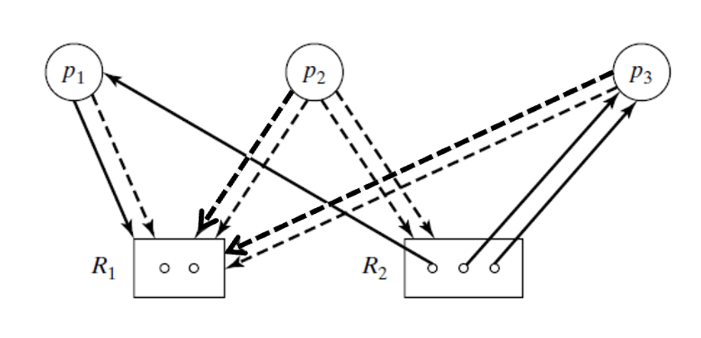

# Week 6

## Banker's algorithm

## Maximum claim graph Using tables

All the tables are based off of this example:

### Static tables
* `c[j]` = number of available resources for `j`
   * | **c** 	| `r1` 	| `r2` 	|
      |---	|----	|----	|
      |   	| 2  	| 3  	|

* `max[i,j]` = maximum number of resources needed by process `i`
  *   | **max** 	| `r1` 	| `r2` 	|
      |-----	|----	|----	|
      | `p1`  	| 2  	| 1  	|
      | `p2`  	| 2  	| 2  	|
      | `p3`  	| 2  	| 2  	|

### Dynamic / "current state" tables

* `av[j]` = available resources of `j`.
  * Defined by `av[j]` = `av[j]` - `req[i,j]`
  *  | **av** 	| `r1` 	| `r2` 	|
      |---	|----	|----	|
      |   	| 2  	| 0  	|
* `alloc[i,j]` = resorces of type `j` in use by process `i`.
  * Defined by `alloc[i,j]` = `alloc[i,j]` + `req[i,j]`
  * | alloc 	| `r1` 	| `r2` 	|
    |-------	|------	|------	|
    | `p1`  	| 0    	| 1    	|
    | `p2`  	| 0    	| 0    	|
    | `p3`  	| 0    	| 2    	|
* `claim[i,j]` = ax number of resources of type `j` to be claimed by process `i`.
  * Defined by `claim[i,j]` = `claim[i,j]` - `req[i,j]`
  * | claim 	| `r1` 	| `r2` 	|
      |-------	|------	|------	|
      | `p1`  	| 2    	| 0    	|
      | `p2`  	| 2    	| 2    	|
      | `p3`  	| 2    	| 0    	|

### Reduction algorithm using tables
1. Assume current state is safe
2. Consider a new request by process `i`
   * `req[i,j]` : number of resources of type `j` requested by process `i`
3. New state is obtained as follows:
   1. `av[j]` = `av[j]` - `req[i,j]`
   2. `alloc[i,j]` = `alloc[i,j]` + `req[i,j]`
   3. `claim[i,j]` = `claim[i,j]` - `req[i,j]`
4. Check if new state is safe
   * Find sequence of processes to finish
